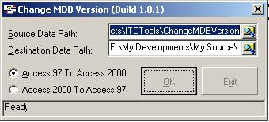



## Change MDB Versions

### Description

For conversion of MS Access Databases between JET 3.X and JET 4.X (MS Access 97 and MS Access 2000) using DAO 3.6. This is my first contribution after years of visiting PSC. Not detail commented. (Please see the ChangeMDBVersion.exe.txt for more information.)
 
### More Info
 
You must have installed DAO 3.6 before using the code.

             |
---                |---
**Submitted On**   |2002-06-05 02:27:26
**By**             |[Alex Au](https://github.com/Planet-Source-Code/PSCIndex/blob/master/ByAuthor/alex-au.md)
**Level**          |Beginner
**User Rating**    |5.0 (45 globes from 9 users)
**Compatibility**  |VB 5\.0, VB 6\.0
**Category**       |[Databases/ Data Access/ DAO/ ADO](https://github.com/Planet-Source-Code/PSCIndex/blob/master/ByCategory/databases-data-access-dao-ado__1-6.md)
**World**          |[Visual Basic](https://github.com/Planet-Source-Code/PSCIndex/blob/master/ByWorld/visual-basic.md)
**Archive File**   |[Change\_MDB91748682002\.zip](https://github.com/Planet-Source-Code/alex-au-change-mdb-versions__1-35604/archive/master.zip)

